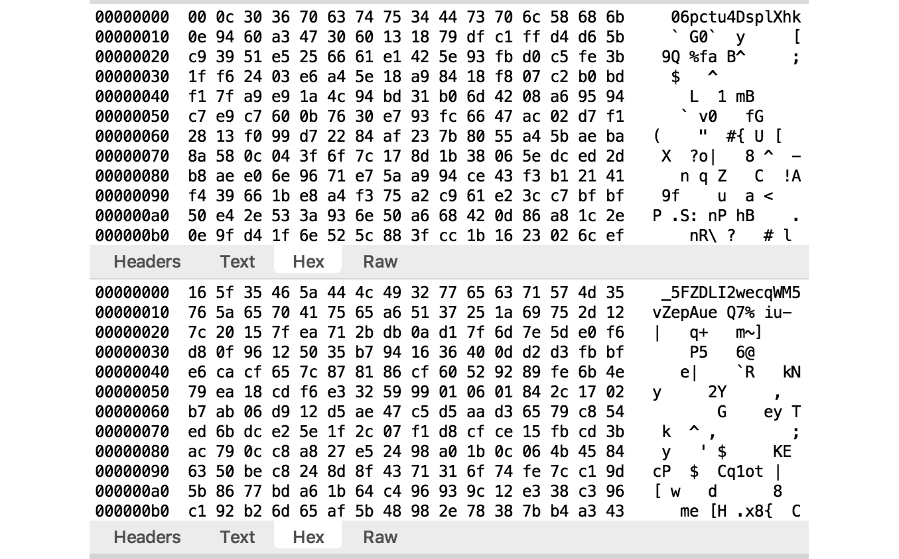
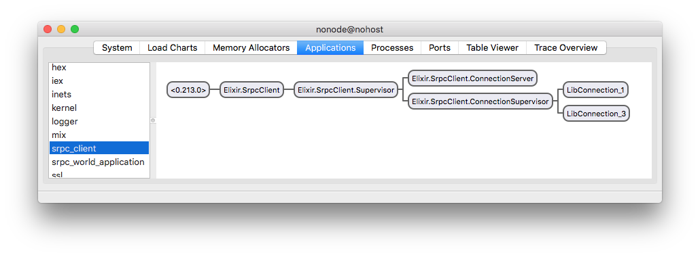

## SrpcWorld

#### A Secure Remote Password Cryptor Demo for Elixir

The Secure Remote Password Cryptor (SRPC) is a security framework based on the [Secure Remote Password](http://srp.stanford.edu/) (SRP) protocol. SRPC builds on SRP to provide application-layer security for client/server communications.

The primary purpose of the `SrpcWorld` demo is to show the touch points for application integration of the SRPC framework. The demo can be configured to use a client-side proxy to examine the structure of the SRPC messaging packets.

The `SrpcWorld` demo consists of the following server and client applications:

  - `SrpcWorld.Server` answers to the following routes
  
     - Simple HTTP requests
        - `/hello` &ndash; says hello to the `name` specified in a URL request query string
        - `/reverse` &ndash; reverses data provided in a URL request
     - HTTP JSON API
        - `/status` &ndash; on/off status of a set of lights
        - `/action` &ndash; control the on/off state of the lights

  - `SrpcWorld.Client` provides a simple API to access the `SrpcWorld.Server` simple HTTP requests
  - `SrpcWorld.Lights` provides a simple API to access the `SrpcWorld.Server` HTTP JSON API

SRPC framework functionality is added through `SrpcPlug` on the server side and `SrpcClient` on the client side.

### <a name="TOC"></a>Table of Contents
  - [Compile SrpcWorld](#Compile)
  - [Start SrpcWorld](#Start)
  - [Run SrpcWorld](#Run)
  - [Inspect Traffic](#Inspect)
  - [Client/Server Configuration](#Configure)
  - [Under the Hood](#UnderTheHood)

### <a name="Compile"></a>Compile SrpcWorld

In each of the client and server directories,

```bash
mix deps.get
mix compile
```

[Table of Contents](#TOC)

### <a name="Start"></a>Start SrpcWorld

In the `server` directory:

```bash
iex -S mix
....
server:iex>
```

In the `client` directory:

```bash
iex -S mix
....
client:iex>
```

Each directory contains an `.iex.exs` file that sets the IEx prompt.

[Table of Contents](#TOC)

### <a name="Run"></a>Run SrpcWorld

##### HTTP calls

`SrpcWorld.Client` provides an API to access `SrpcWorld.Server`. For example, `SrpcWorld.Client.say_hello/1` sends an HTTP GET `/hello` request to the server. However, we want this communication to be secure, so `SrpcWorld.Client` actually uses the SRPC framework to make the call. First, let's say hello to "Elixir" in the client IEx shell.

```elixir
client:iex> SrpcWorld.Client.say_hello "Elixir"
10:02:21.703 [info]  Connected to http://localhost:8082 via proxy http://localhost.charlesproxy.com:8888
"Aloha Elixir"
```

The `SrpcWorld.Server` is apparently vacationing in Hawai&#8216;i as we see the __*say_hello*__ response is _Aloha Elixir_.

The info log message received before the __*say_hello*__ response informs us that the client connected to the `SrpcWorld.Server` at the specified URL. Whenever the `SrpcWorld.Client` makes a call, it uses an SRPC connection maintained in its `GenServer` state. Since there was no existing connection, one was created in `SrpcWorld.Client` with the call
```elixir
  {:ok, conn} = SrpcClient.connect()
```

`SrpcClient.connect/0` returns a `SrpcClient.Connection` that can be used to make secure calls to the `SrpcWorld.Server`, such as in the implementation of `SrpcWorld.Client.say_hello/1`:

```elixir
  conn
  |> SrpcClient.get("/hello?name=#{name}")
```

Subsequent `SrpcWorld.Client` calls use the same `SrpcClient.Connection`:

```elixir
client:iex> SrpcWorld.Client.reverse "Stressed was I ere I saw desserts"
"stressed was I ere I saw dessertS"
```

##### Controlling lights

`SrpcWorld.Server` also fronts a set of lights that can be controlled using the client-side `SrpcWorld.Lights` module. Controlling the lights first requires a valid user login. For this demo we'll register a user on the fly with `SrpcWorld.Client.register/2`.

```elixir
client:iex> SrpcWorld.Client.register("srpc", "secret")
:ok
```

Now we can login to the `SrpcWorld.Server` using `SrpcWorld.Lights.login/2`:

```elixir
client:iex> SrpcWorld.Lights.login("srpc", "secret")
:ok
```

If you've configured a proxy to observe SRPC traffic you'll see that no information regarding the user ID or password is visible (or even leaks) during either SRPC registration or login messaging. In fact, the user password *never leaves the client*. The [Under the Hood](#UnderTheHood) section describes what data is actually used to authenticate a user.

Let's get the status of the lights:

```elixir
client:iex> SrpcWorld.Lights.status()
%{"green" => "off", "red" => "off", "yellow" => "off"}
```

All the lights are off. Let's turn the **red** light on:

```elixir
client:iex> SrpcWorld.Lights.on("red")
%{"green" => "off", "red" => "on", "yellow" => "off"}
```

Now let's turn the **green** light on:

```elixir
client:iex> SrpcWorld.Lights.on("green")
%{"green" => "on", "red" => "on", "yellow" => "off"}
```

Note the **red** light stayed on. We could use `SrpcWorld.Lights.off/1` to turn the **red** light off, or we could use `SrpcWorld.Lights.switch/1` which switches to a particular light and turns off all the others:

```elixir
client:iex> SrpcWorld.Lights.switch("yellow")
%{"green" => "off", "red" => "off", "yellow" => "on"}
```

In all of the above calls, `SrpcWorld.Lights` is sending HTTP JSON API requests to `SrpcWorld.Server` using `SrpcClient.post/2`. All the calls are secured via the SRPC framework.

[Table of Contents](#TOC)

### <a name="Inspect"></a>Inspect Traffic

The demo can be configured to use a proxy to inspect the traffic between the `SrpcWorld.Client` and `SrpcWorld.Server`. Using such a proxy will reveal that all SRPC calls "look" identical. Each call is an HTTP POST to the URL __*http://host:port/*__ (where the `host` and `port` are specified in the configuration files). Neither the request nor response headers contain any meaningful `SrpcWorld` demo application information. And the request and response bodies are encrypted. The bodies of an example request (top) and response (bottom) looks like:



[Table of Contents](#TOC)

#### <a name="Configure"></a>Configure SrpcWorld

Most of the demo configuration should not be changed. However, values of interest that can be changed on the server are `host` and `port` and on the client are `port` and an optional `proxy` setting.

##### SrpcWorld.Server

Server-side settings are in __*server/config/config.exs*__.

<a name="ServerConfig"></a>
###### :srpc_plug

Server-side SRPC framework functionality is provided by the `SrpcPlug` module. `SrpcPlug` shares a pre-defined [SRP](http://srp.stanford.edu/whatisit.html) relationship with the `SrpcClient` module used by `SrpcWorld.Client`. The server portion of this pre-defined relationship is contained in the `server/priv/server.srpc` file and should not be altered. The SRPC framework also requires a module that provides the `SrpcHandler` behaviour (to maintain server-side state for the SRPC framework).

```elixir
config :srpc_plug,
    srpc_file: "priv/server.srpc",
    srpc_handler: SrpcWorld.Server.SrpcHandler
```

`SrpcWorld` uses the `Cowboy` HTTP server.

###### :cowboy
```elixir
config :cowboy,
  cowboy_opts: [
    port: 8082,
    acceptors: 5
  ]
```

The `SrpcWorld.Server.SrpcHandler` module uses `kncache` (a simple cache) for maintaining server-side data. These settings configure the necessary caches and default TTLs.

###### :kncache
```elixir
config :kncache,
  caches: [
    srpc_exch: 30,
    srpc_nonce: 35,
    srpc_conn: 10800,
    srpc_reg: 10800,
    user_data: 10800
  ]
```

##### SrpcWorld

Client-side settings are in __*client/config/config.exs*__.

Client-side SRPC framework functionality is provided by the `SrpcClient` module. `SrpcClient` shares a pre-defined [SRP](http://srp.stanford.edu/whatisit.html) relationship with the `SrpcPlug` module used by `SrpcWorld.Server`. The client portion of this pre-defined relationship is contained in the `client/priv/client.srpc` file and should not be altered.

<a name="ClientConfig"></a>
###### :srpc_client
```elixir
config :srpc_client, srpc_file: "priv/client.srpc"
```

`SrpcWorld` clients connect to the `SrpcWorld.Server` on a specified `host` and `port`.

```elixir
config :srpc_client, :server,
  host: "localhost",
  port: 8082
```

###### :srpc_poison

An optional `proxy` configuration allows  HTTP traffic to be channeled through a proxy for inspection purposes. This setting is passed to `HTTPoison` as a request option. See [HTTPoison](https://hexdocs.pm/httpoison/HTTPoison.html#request/5) for further information. Setting the `proxy` configuration would look like:

```elixir
config :srpc_poison, proxy: "http://localhost.charlesproxy.com:8888"
```

[Table of Contents](#TOC)

### <a name="UnderTheHood"></a>Under The Hood

Both `SrpcWorld.Client` and `SrpcWorld.Lights` use an `SrpcClient.Connection` to communicate securely with `SrpcWorld.Server`. `SrpcWorld.Client` does not require a valid user login but still ensures mutual authentication between the `SrpcClient` being used by `SrpcWorld.Client` and the `SrpcPlug` being used by `SrpcWorld.Server`. This mutual authentication is achieved using values in the files specified by the `:srpc_file` configuration of the [client](#ClientConfig) and [server](#ServerConfig). These values form the pre-defined relationship between the SRPC client and server processes.

##### SRPC Lib Connection

Let's take a first peek under the hood by creating an `SrpcClient.Connection`. It might be best to [restart](#Start) both the client and server applications to clean out any residue from earlier demo activity.

```elixir
client:iex> SrpcClient.connect()
{:ok, #PID<0.232.0>}
```

We got a connection, but we didn't grab it. Let's fix that:

```elixir
client:iex> {:ok, conn} = SrpcClient.connect()
{:ok, #PID<0.232.0>}
```

Because the `SrpcClient.connect/0` call does not specify user credentials, the connection returned is an SRPC __*lib connection*__ (i.e., a connection that has mutually authenticated the SRPC libraries in use). We can get information regarding the connection using `SrpcClient.info/1`:

```elixir
client:iex> SrpcClient.info(conn)
%SrpcClient.Conn.Info{accessed: 29, created: 29, keyed: 29, name: :LibConnection_2}
```

The info reports (in seconds) how long ago the connection was created, accessed, and keyed, as well as the name. Note the `conn` reference actually represents the second connection we created since we didn't capture the first.

We can use the connection by sending it to various `SrpcClient` calls. For example, to POST a request to reverse the string 'string':

```elixir
client:iex> SrpcClient.post(conn, "/reverse", "string")
{:ok, "gnirts"}
```

Inspecting the connection info again, we'll see the access age has been updated:

```elixir
client:iex> SrpcClient.info(conn)
%SrpcClient.Conn.Info{accessed: 18, created: 127, keyed: 127, name: :LibConnection_2}
```

We can close `:LibConnection_2` and get a new one

```elixir
client:iex> SrpcClient.close(conn)
:ok
client:iex> {:ok, conn} = SrpcClient.connect()
{:ok, #PID<0.304.0>}
client:iex> SrpcClient.info(conn)
%SrpcClient.Conn.Info{accessed: 10, created: 10, keyed: 10, name: :LibConnection_3}
client:iex> :observer.start
```

The `SrpcClient` application structure at this point looks like:



There are two connections. `LibConnection_3` is our current `conn`, and `LibConnetion_1` is the first connection we didn't capture a reference to. Let's close that dangling connection. `SrpcClient.connections/0` returns a list of `{atom, pid}` pairs. We can use that call to close `LibConnection_1`:

```elixir
client:iex> SrpcClient.connections |> Keyword.get(:LibConnection_1) |> SrpcClient.close
:ok
```

We still have our one, lone `LibConnection_3` connection bound to `conn`. We can get detailed information regarding this connection via `SrpcClient.info/2`:

```elixir
client:iex> SrpcClient.info(conn, :full)
%SrpcClient.Conn{
  accessed: -576460709,
  conn_id: "GRTrtTQjRhDFFMdj6m9jR6QP8f",
  created: -576460709,
  entity_id: "srpc_demo_Gc6kmLMM",
  keyed: -576460709,
  name: :LibConnection_3,
  proxy: "http://localhost.charlesproxy.com:8888",
  req_mac_key: <<52, 73, 54, 87, 104, 254, 169, 40, 20, 48, 14, 35, 227, 56,
    249, 112, 167, 148, 100, 227, 229, 169, 224, 225, 72, 30, 187, 12, 166, 244,
    71, 164>>,
  req_sym_key: <<234, 195, 65, 96, 32, 2, 210, 55, 188, 103, 57, 243, 230, 33,
    237, 128, 199, 236, 149, 153, 115, 110, 89, 249, 216, 181, 78, 42, 22, 30,
    118, 198>>,
  resp_mac_key: <<211, 138, 26, 169, 189, 154, 35, 121, 6, 115, 110, 117, 167,
    210, 180, 181, 62, 178, 139, 132, 113, 169, 82, 240, 192, 128, 22, 9, 122,
    92, 119, 32>>,
  resp_sym_key: <<38, 19, 157, 118, 106, 136, 168, 68, 120, 135, 239, 58, 110,
    5, 51, 213, 111, 217, 207, 234, 181, 241, 47, 241, 35, 232, 163, 180, 122,
    233, 164, 108>>,
  sha_alg: :sha256,
  sym_alg: :aes256,
  time_offset: 0,
  type: :lib,
  url: "http://localhost:8082"
}
```

The information includes four binary keys. The `*_sym_key`s are used for encryption (confidentiality) and the `*_mac_key`s are used for message authentication codes (data integrity and origin). Distinct keys are used in each direction of messaging.

Let's see how this connection info is handled on the server side. For the `SrpcWorld` demo, server-side SRPC processing is handled by the `SrpcPlug` module. There is an `:srpc_srv` module (written in Erlang) but it is a library, not an application, and hence has no state. It is up to the server-side application to provide necessary SRPC state management via a module providing the `:srpc_handler` behaviour. In the `SrpcWorld` demo, the configured [SRPC handler](#ServerConfig) is `SrpcWorld.Server.SrpcHandler`. 

To view the server-side information for the `LibConnection_3` connection, switch over to the server iex shell and use the `conn_id` from the `SrpcClient.info/2` listing above:

```elixir
server:iex> SrpcWorld.Server.SrpcHandler.get_conn("GRTrtTQjRhDFFMdj6m9jR6QP8f")
{:ok,
  %{
    conn_id: "GRTrtTQjRhDFFMdj6m9jR6QP8f",
    entity_id: "srpc_demo_Gc6kmLMM",
    req_mac_key: <<52, 73, 54, 87, 104, 254, 169, 40, 20, 48, 14, 35, 227,
      56, 249, 112, 167, 148, 100, 227, 229, 169, 224, 225, 72, 30, 187, 12,
      166, 244, 71, 164>>,
    req_sym_key: <<234, 195, 65, 96, 32, 2, 210, 55, 188, 103, 57, 243, 230,
      33, 237, 128, 199, 236, 149, 153, 115, 110, 89, 249, 216, 181, 78, 42,
      22, 30, 118, 198>>,
    resp_mac_key: <<211, 138, 26, 169, 189, 154, 35, 121, 6, 115, 110, 117,
      167, 210, 180, 181, 62, 178, 139, 132, 113, 169, 82, 240, 192, 128, 22,
      9, 122, 92, 119, 32>>,
    resp_sym_key: <<38, 19, 157, 118, 106, 136, 168, 68, 120, 135, 239, 58,
      110, 5, 51, 213, 111, 217, 207, 234, 181, 241, 47, 241, 35, 232, 163,
      180, 122, 233, 164, 108>>,
    sha_alg: :sha256,
    sym_alg: :aes256,
    type: :lib
  }}
```

 Note the `conn_id`, `entity_id`, `type` and cryptographic keys are identical on each side of the connection.

##### SRPC User Registration

On the client, let's register a new user:

```elixir
client:iex> SrpcClient.register "chigurh", "call it"
:ok
```

and then look at what information is received and maintained by the server:

```elixir
server:iex> {:ok, anton} = SrpcWorld.Server.SrpcHandler.get_registration("chigurh")
{:ok,
 %{
   kdf_salt: <<30, 236, 221, 5, 212, 53, 212, 93, 217, 120, 128, 147>>,
   srp_salt: <<167, 55, 209, 145, 231, 80, 97, 187, 254, 127, 142, 111, 78, 22,
     47, 41, 212, 166, 108, 74>>,
   user_id: "chigurh",
   verifier: <<142, 20, 242, 36, 208, 214, 100, 242, 134, 69, 249, 127, 210,
     202, 140, 6, 239, 186, 164, 232, 230, 232, 95, 245, 92, 79, 86, 124, 45,
     227, 73, 95, 88, 6, 48, 183, 29, 198, 6, 100, 206, 58, 178, 249, ...>>
 }}
server:iex> Base.encode16(anton[:verifier])
"8E14F224D0D664F28645F97FD2CA8C06EFBAA4E8E6E85FF55C4F567C2DE3495F580630B71DC60664CE3AB2F94823584F8C4571033842A5ED01C1ABE43468070F9DEF1B67C838E4C54F00BD6F95B08BB6362B42C8DD9325BEAF5DC2E33F8046B55F18007C814EE243CA8631CA4EB2142005469B467C2270DE48762FE28FE585DD9F9AC08DE61CFBE0F68734B83492C0925B9234AD62AF7A0CE93A78F934F8F7BDAF2283943F2A84C93D45CEC621E3B9A65D8114386CD57F7DB96008E63D7940A806523D260CFC5DD9E130A92416AE6758DBA944504CBA44AF9F5A0ABA42E29CC1D157A9491DE0260AC83F65AB4B9FE307CED906CE80D8C7ABC52BE5EA4B1F29EE"
```

Since the `verifier` output was elided we output a hex version to see the full 256 bytes.

`SrpcClient.register/2` calculates the `verifier` using `kdf_salt` for PDKDF2 key stretching of the password, which is then input into the calculation of the user's [SRP](http://srp.stanford.edu/design.html) private key, which uses `srp_salt`. The server-side processing maintains these three binary values for each user. 

##### SRPC User Connection

During SRPC user authentication, the server sends the `kdf_salt` and `srp_salt` values back to the client. This prevents the client from having to maintain any long term secret user state, allowing the user's password to fulfill that role. The client uses the salts and user password to recreate the user's [SRP](http://srp.stanford.edu/design.html) private key. The client and server are thus able to use the [SRP](http://srp.stanford.edu/design.html) protocol to dynamically calculate a cryptographically strong shared secret, which is used as keying material to generate the four SRPC connection cryptographic keys.

`SrpcClient.connect/2` creates a connection for a specific user:

```elixir
client:iex> {:ok, conn} = SrpcClient.connect "chigurh", "call it"
{:ok, #PID<0.246.0>}
```

Unlike the previous use of `SrpcClient.connect/0`, which returned an SRPC lib connection, `SrpcClient.connect/2` returns an SRPC __*user connection*__ that is bound to a specific user. Such a user connection achieves mutual authentication between the user (via the user password) and the server (via the stored user verifier), ensuring that the client application is acting on behalf of a specified user known to the server.

User registration and login both require an existing SRPC connection to secure user information during processing. The functions `SrpcClient.register/2` and `SrpcClient.connect/2` used above automatically create an SRPC lib connection to perform their duties and close the connection when done. Functions `SrpcClient.register/3` and `SrpcClient.connect/3` accept an existing `SrpcClient.Connection` as their first argument.

As with previous connections, we can inspect a user connection using `SrpcClient.info/1`:

```elixir
client:iex> SrpcClient.info(conn, :full)
%SrpcClient.Conn{
  accessed: -576460693,
  conn_id: "NQbJJ2hBgjjfqnJ9Lfm4tQHm6Q",
  created: -576460693,
  entity_id: "chigurh",
  keyed: -576460693,
  name: :UserConnection_1,
  req_mac_key: <<85, 145, 155, 185, 254, 33, 95, 231, 12, 192, 116, 68, 6, 149,
    109, 117, 171, 79, 104, 250, 237, 131, 217, 249, 205, 173, 137, 23, 1, 0,
    136, 90>>,
  req_sym_key: <<107, 204, 232, 133, 180, 85, 147, 217, 183, 125, 167, 38, 95,
    5, 221, 122, 117, 57, 54, 156, 93, 219, 77, 223, 196, 151, 156, 242, 25,
    139, 118, 71>>,
  resp_mac_key: <<244, 119, 176, 20, 34, 129, 131, 0, 243, 145, 92, 157, 139,
    187, 202, 209, 193, 170, 245, 217, 250, 60, 197, 238, 194, 13, 23, 204, 138,
    253, 248, 161>>,
  resp_sym_key: <<233, 191, 187, 135, 233, 138, 127, 153, 128, 20, 228, 196,
    234, 1, 137, 231, 0, 213, 178, 221, 226, 232, 123, 97, 71, 109, 228, 39,
    228, 168, 81, 219>>,
  sha_alg: :sha256,
  sym_alg: :aes256,
  time_offset: 0,
  type: :user
  url: "http://localhost:8082"
}
```

and on the server:

```elixir
server:iex> SrpcWorld.Server.SrpcHandler.get_conn("NQbJJ2hBgjjfqnJ9Lfm4tQHm6Q")
{:ok,
 %{
   conn_id: "NQbJJ2hBgjjfqnJ9Lfm4tQHm6Q",
   entity_id: "chigurh",
   req_mac_key: <<85, 145, 155, 185, 254, 33, 95, 231, 12, 192, 116, 68, 6,
     149, 109, 117, 171, 79, 104, 250, 237, 131, 217, 249, 205, 173, 137, 23, 1,
     0, 136, 90>>,
   req_sym_key: <<107, 204, 232, 133, 180, 85, 147, 217, 183, 125, 167, 38, 95,
     5, 221, 122, 117, 57, 54, 156, 93, 219, 77, 223, 196, 151, 156, 242, 25,
     139, 118, 71>>,
   resp_mac_key: <<244, 119, 176, 20, 34, 129, 131, 0, 243, 145, 92, 157, 139,
     187, 202, 209, 193, 170, 245, 217, 250, 60, 197, 238, 194, 13, 23, 204,
     138, 253, 248, 161>>,
   resp_sym_key: <<233, 191, 187, 135, 233, 138, 127, 153, 128, 20, 228, 196,
     234, 1, 137, 231, 0, 213, 178, 221, 226, 232, 123, 97, 71, 109, 228, 39,
     228, 168, 81, 219>>,
   sha_alg: :sha256,
   sym_alg: :aes256,
   type: :user
 }}
```

SRPC lib and user connections are identical in terms of use. The only difference is a lib connection represents a mutually authenticated channel between the SRPC framework libraries in use, whereas a user connection __*also*__ ensures mutual authentication via the user's password (client) and verifier (server). Note the emphasis of __*also*__. Both user registration and login require an existing SRPC lib or user connection. If a user connection is used, that connection must be rooted in an SRPC lib connection. This ensures no user information is ever transmitted unencrypted.
